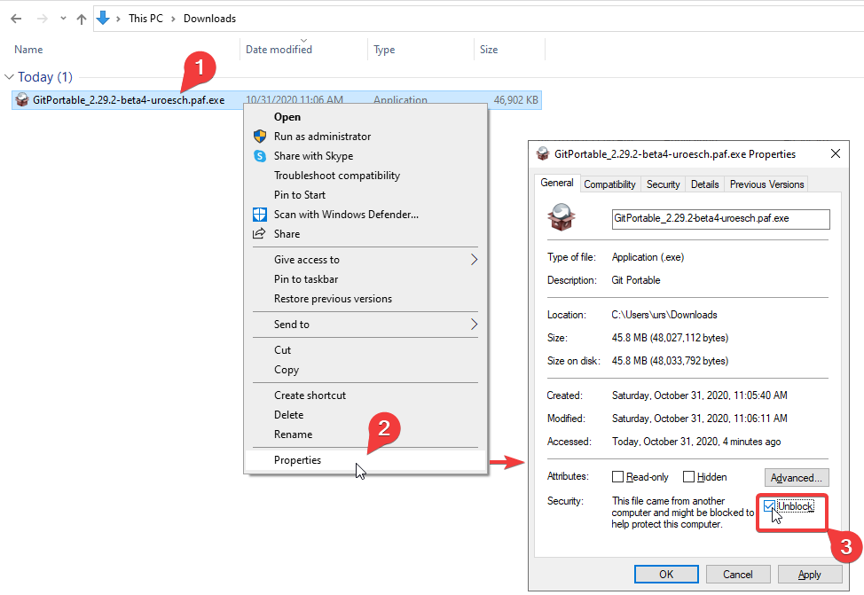

[](https://github.com/uroesch/ShareXPortable/actions?query=workflow%3Abuild-package)
[](https://github.com/uroesch/ShareXPortable/releases)
[](#runtime-dependencies)
[](#runtime-dependencies)


# ShareX for PortableApps.com


[ShareX](https://getsharex.com) is a free and open source program
that lets you capture or record any area of your screen and share
it with a single press of a key. It also allows uploading images,
text or other types of files to many supported destinations you 
can choose from.

It is published under the GNU General Public License. The project's 
source code is hosted at the GitHub code-sharing and code development
platform.

## Runtime dependencies
* 32-bit or 64-bit version of Windows.
* .Net 4.0 or higher.

## Support matrix

| OS              | 32-bit             | 64-bit              | 
|-----------------|:------------------:|:-------------------:|
| Windows XP      | ![ns][ns]          | ![ns][ns]           | 
| Windows Vista   | ![ns][ns]          | ![ns][ns]           | 
| Windows 7       | ![ps][ps]          | ![ps][ps]           |  
| Windows 8       | ![ps][ps]          | ![ps][ps]           |  
| Windows 10      | ![fs][fs]          | ![fs][fs]           |

Legend: ![ns][ns] not supported;  ![nd][nd] no data; ![ps][ps] supported but not verified; ![fs][fs] verified;`

## Status 
This PortableApps project is in early beta stage. 

## Todo
- [ ] Documentation
- [x] Include ffmpeg binary.

<!-- Start include INSTALL.md -->
## Installation

The Packages found under the release page are not digitally signed so there the installation
is a bit involved.

After download the `.paf.exe` installer trying to install may result in a windows defender
warning.


To unblock the installer and install the application follow the annotated screenshot below.



1. Right click on the executable file.
2. Choose `Properties` at the bottom of the menu.
3. Check the unblock box.
<!-- End include INSTALL.md -->

<!-- Start include BUILD.md -->
### Build

#### Windows 10

To build the installer run the following command in the root of the git
repository.

```
powershell -ExecutionPolicy ByPass -File Other/Update/Update.ps1
```

#### Linux (Docker)

Note: This is currently the preferred way of building.

For a Docker build run the following command.

```
curl -sJL https://raw.githubusercontent.com/uroesch/PortableApps/master/scripts/docker-build.sh | bash
```

#### Linux (Wine)

To build the installer under Linux with Wine and PowerShell installed run the
command below.

```
pwsh Other/Update/Update.ps1
```
<!-- End include BUILD.md -->

[nd]: Other/Icons/no_data.svg
[ns]: Other/Icons/no_support.svg
[ps]: Other/Icons/probably_supported.svg
[fs]: Other/Icons/full_support.svg
